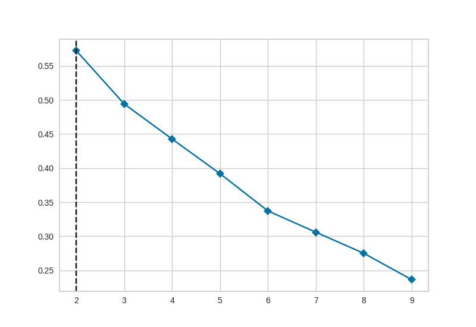
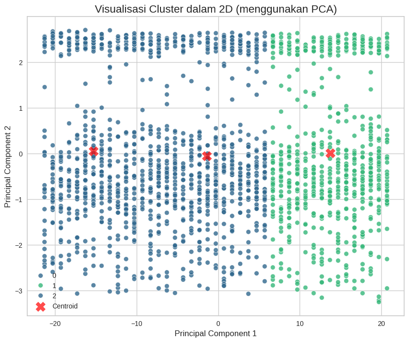

# Customer Segmentetion using K-Means

## Overview
This project applies K-Means Clustering to segment customerrs based on their transaction and balence characteris

## Tools
- Pythone
- Pandas
- Scikit-Leanr
- Matplotlib
- Seaborn
- Google Colab

## Elobw Methd

## Cluster Visualization

## Repository
Create by Faneey
